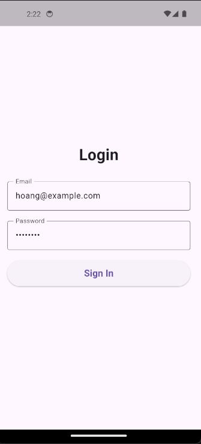
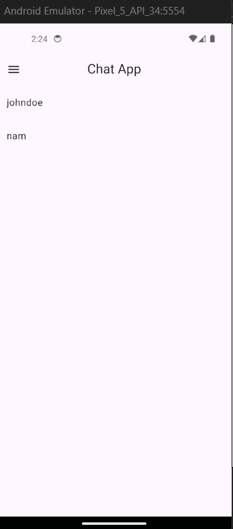
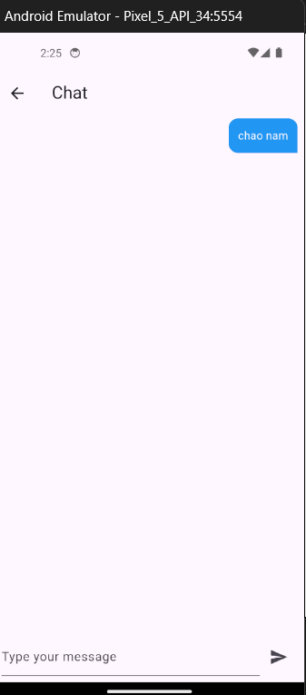
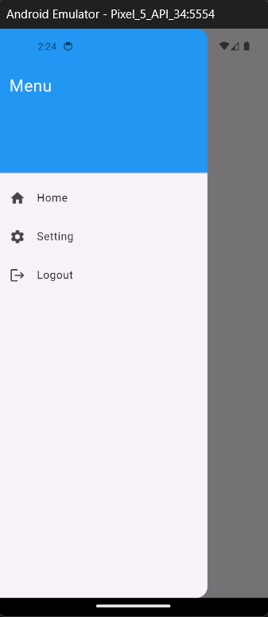

# Chat Application

A full-stack real-time chat application with Flutter mobile frontend and Node.js backend.

## Overview

This project is a complete chat application featuring real-time messaging, user authentication, and a responsive mobile interface. Built with Flutter for the frontend and Node.js/TypeScript for the backend, it demonstrates modern full-stack development practices.

## Features

- **User Authentication**: Secure login system with JWT token-based authentication
- **Real-Time Messaging**: Instant message delivery using WebSocket technology
- **User Profiles**: View and manage user information and settings
- **Message History**: Persistent message storage in MongoDB
- **Responsive UI**: Material Design interface optimized for mobile devices
- **State Management**: Provider pattern for efficient state handling

## Tech Stack

### Frontend

- **Framework**: Flutter (Dart)
- **State Management**: Provider
- **Networking**: HTTP Client, WebSocket Channel
- **UI**: Material Design
- **Libraries**: FlutterToast, HTTP, Web Socket Channel

### Backend

- **Runtime**: Node.js with TypeScript
- **Framework**: Express.js
- **Database**: MongoDB
- **Real-Time**: WebSocket (ws)
- **Authentication**: JWT (JSON Web Tokens)
- **Tools**: ESLint, Prettier, Nodemon

## Project Structure

```
chat_flutter/
├── frontend/                 # Flutter mobile application
│   ├── lib/
│   │   ├── main.dart        # App entry point
│   │   ├── layouts/         # App layout components
│   │   ├── screen/          # UI screens
│   │   │   ├── login_screen.dart
│   │   │   ├── home_screen.dart
│   │   │   ├── chat_screen.dart
│   │   │   ├── profile_screen.dart
│   │   │   └── setting_screen.dart
│   │   ├── model/           # Data models
│   │   ├── provider/        # State management
│   │   └── image/           # Screenshots
│   ├── android/             # Android native code
│   ├── ios/                 # iOS native code
│   └── pubspec.yaml         # Dependencies
│
└── server/                   # Node.js backend
    ├── src/
    │   ├── index.ts         # Server entry point
    │   ├── routes/          # API routes
    │   ├── models/          # Database models
    │   ├── controllers/     # Business logic
    │   ├── services/        # Services
    │   ├── db/              # Database connection
    │   └── middlewares/     # Express middlewares
    ├── package.json         # Dependencies
    └── tsconfig.json        # TypeScript config
```

## Screenshots

### Login Screen

User authentication with email and password validation.



### Home Screen

Display conversations with users and quick access to chats.



### Chat Screen

Real-time message interface with message input and history.



### Menu

Navigation drawer with access to home, settings, and logout.



## Key Implementation Details

### Authentication Flow

- User logs in with email and password
- Backend validates credentials and returns JWT token
- Token is stored and used for subsequent API requests
- WebSocket connection authenticated using the same token

### Real-Time Messaging

- WebSocket connection established with JWT authentication
- Messages sent instantly to all connected clients in conversation
- Message history retrieved from MongoDB on chat screen load
- Automatic message synchronization across active connections

### Database Schema

- Users collection: Stores user profiles and credentials
- Messages collection: Stores chat messages with sender, content, and timestamp
- Conversations collection: Links users and their message threads

## Getting Started

### Frontend

```bash
cd frontend
flutter pub get
flutter run
```

### Backend

```bash
cd server
npm install
npm run dev
```

## API Endpoints

- `POST /api/auth/login` - User login
- `GET /api/auth/me` - Get current user profile
- `GET /api/chat/recent_messages` - Fetch message history
- `WS /` - WebSocket connection for real-time messaging

## Deployment

- **Frontend**: Built for Android and iOS platforms
- **Backend**: Deployed on Render platform
- **Database**: MongoDB cloud or local instance

## Future Enhancements

- Group chat functionality
- Message search and filtering
- User blocking and privacy controls
- Image and file sharing
- Typing indicators and read receipts
- Push notifications

## Author

Duong Van Hoan
